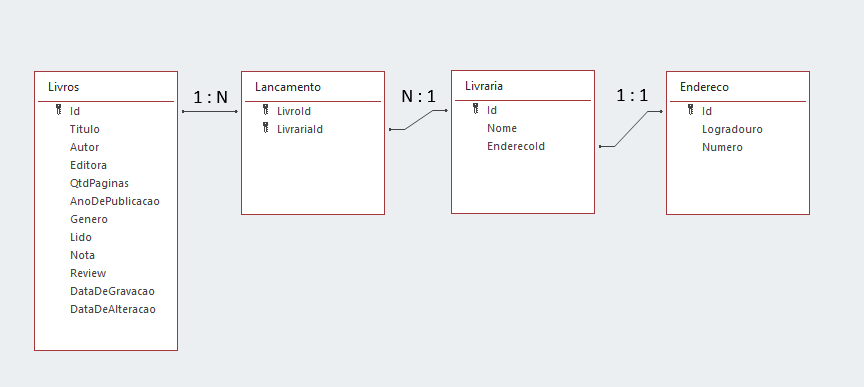
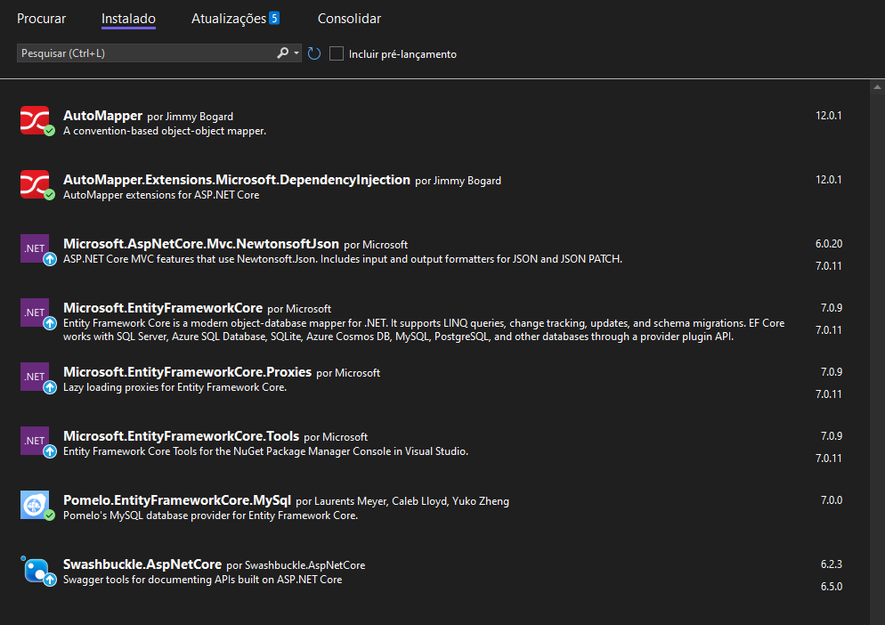
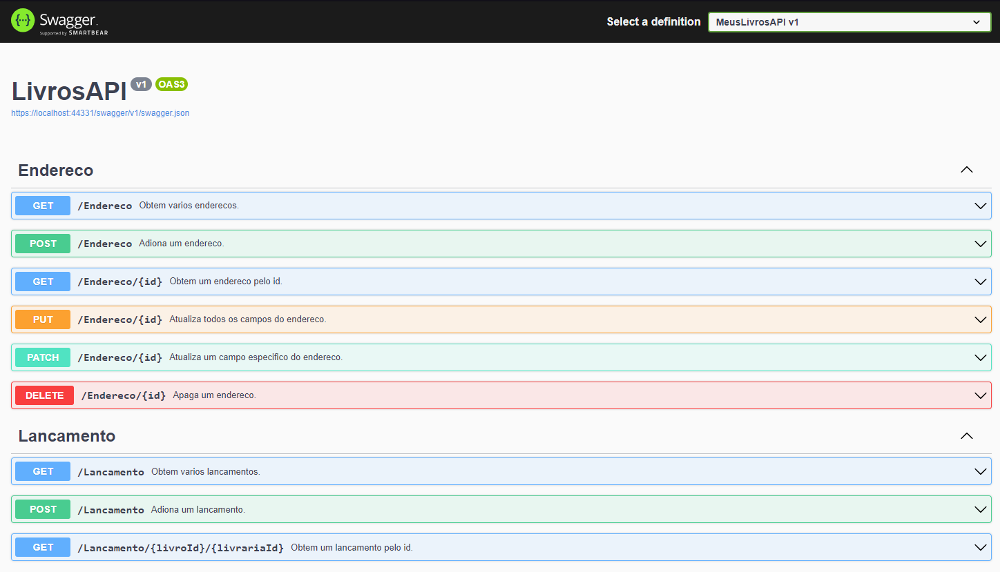

# Meus Livros API

Bem-vindo ao Projeto Meus Livros API! 

Neste arquivo README, você encontrará informações úteis sobre o funcionamento do projeto.

## Índice

- [Sobre](#sobre)
- [Tecnologias e Frameworks](#tecnologias-e-frameworks)
- [Preparação do ambiente](#preparação-do-ambiente)
- [Em funcionamento](#em-funcionamento)
- [Conclusão](#conclusão)

## Sobre

O projeto consiste em uma API com comunicação com um banco de dados SQL para realizar o cadastro de lançamentos de livros em livrarias.
Quando vamos realizar um lançamento devemos escolher um livro e uma livraria, a livraria por si só esta relacionada a um endereço, enquanto o livro esta relacionado a um lançamento.
Seguino o modelo de entidade relacional do banco de dados.

## Tecnologias e Frameworks 

Neste projeto, foi utilizado as seguintes tecnologias:

- C# 
- .NET 6
- ASP .NET Core
- Entity Framework
- Swashbuckle / Swagger
- Auto Mapper
- IIS Express
- MySql / MySql Workbench
- Rest

## Preparação do ambiente

1. Clone este repositório: `git clone https://github.com/M-LaScala/Meus-Livros-API`
2. Navegue até o diretório do projeto e abra o arquivo .SLN com o visual studio 2022+
3. Instale os pacote NuGet dependentes

Entity Framework => O Entity Framework é um conjunto de tecnologias de mapeamento objeto-relacional (ORM) que permite criar uma camada de acesso a dados limpa, portátil e de alto nível com o .NET (C#) dando suporte a consultas LINQ, controle de alterações, atualizações e migrações de esquema.

AutoMapper => O AutoMapper é uma biblioteca de mapeamento de objetos em C# que simplifica a conversão de dados entre objetos de diferentes tipos.

Swashbuckle => O Swashbuckle é uma biblioteca para ASP.NET Core que facilita a integração do Swagger em aplicativos da web, permitindo que os desenvolvedores criem e publiquem facilmente documentação para suas APIs.

IIS Express => O IIS Express (Internet Information Services Express) é um servidor web leve projetado para desenvolvedores permitindo a execução local de aplicativos web em ambiente Windows.

Newtonsoft.Json => O Newtonsoft.Json - Json.NET, é uma popular biblioteca de serialização e desserialização JSON para a plataforma .NET. Ele simplifica a conversão de objetos .NET em formato JSON e vice-versa

## Em funcionamento

Com o ambiente preparado ao executar a aplicação você irá se deparar com a documentação interativa da API do Swagger, contendo tudo o que você precisa para fazer as chamadas as APIs, lembrando que para a aplicação funcionar deve ser criado um banco de dados e atravez do entity framework realizar as devidas atualizações e migrações do esquema.
Sinta-se à vontade para experimentar a aplicação.

## Conclusão

Esta aplicação foi criada com o intuito de estudar diversas tecnologias e padrões de arquitetura presentes no mercado, de forma pratica e intuitiva.

